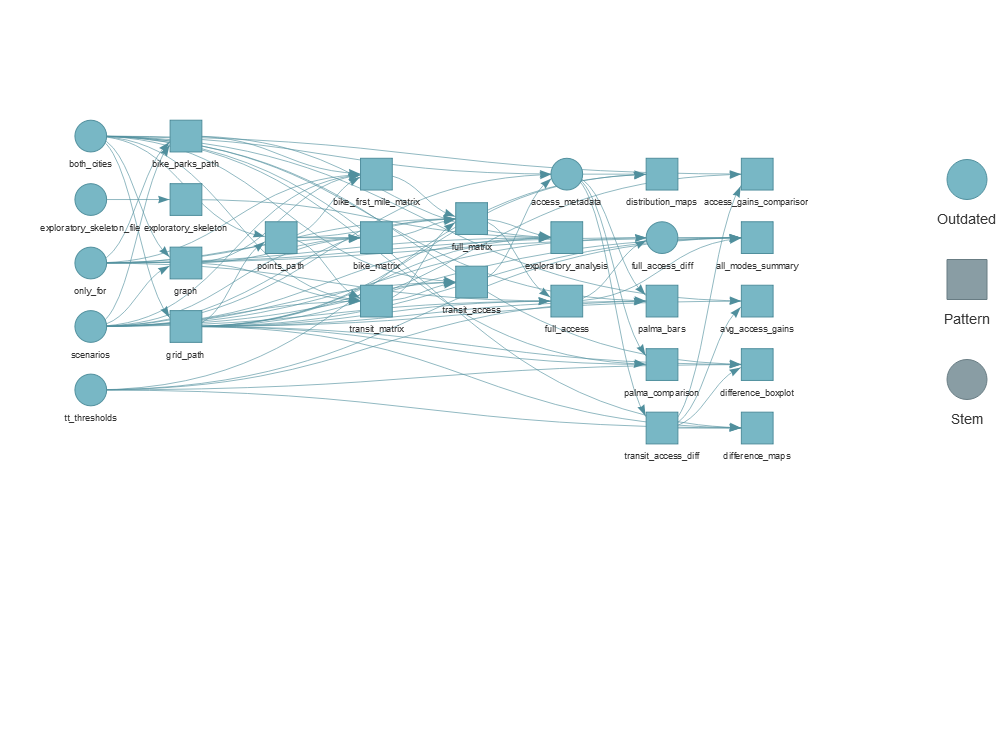

# Impactos da expansão do Metrô de Fortaleza sobre o acesso a oportunidades de emprego, saúde e educação
 


Este repositório contém os dados e o código utilizado no desenvolvimento
do Texto para Discussão **Impactos da expansão do Metrô de Fortaleza
sobre o acesso a oportunidades de emprego, saúde e educação**,
produzidos no âmbito do [Projeto Acesso Oportunidades (IPEA)](https://www.ipea.gov.br/acessooportunidades/) em parceria
com o Ministério do Desenvolvimento Regional. O estudo está disponível para download nos links abaixo:
- [Estudo completo](https://www.ipea.gov.br/portal/images/stories/PDFs/TDs/220518_218180_td_2767_web.pdf)
- [Sumário Executivo](https://www.ipea.gov.br/portal/images/stories/PDFs/TDs/220518_218180_td_2767_sumex.pdf)

A divulgação e publicização deste repositório tem como objetivo garantir a
transparência do trabalho realizado. Os dados e códigos necessários para
rodar as análises do trabalho estão dispostos conforme explicado na
seção *[Estrutura dos arquivos](#estrutura-dos-arquivos)*, e podem ser
utilizados para gerar os resultados do estudo caso sejam seguidas as
instruções apresentadas na seção *[Rodando as
análises](#rodando-as-análises)*. No entanto, nós **não** garantimos a
total reprodutibilidade do trabalho, visto que o comportamento das
funções utilizadas no código está condicionado a diversos fatores, como
a versão instalada do R, a versão dos demais pacotes utilizados e o
sistema operacional utilizado. Ao final deste documento nós listamos
informações relevantes do *[Ambiente de
trabalho](#ambiente-de-trabalho)* usado no desenvolvimento do estudo.

## Instalação

A primeira etapa para rodar as análises desse projeto é clonar o
repositório. Para isso, use o comando:

    git clone https://github.com/ipeaGIT/avaliacao_intervencoes.git

## Estrutura dos arquivos

Os arquivos que compõem este repositório foram organizados de forma que
cada pasta armazene arquivos com uma determinada finalidade:

-   `R/` - código utilizado no projeto;
-   `data-raw/` - dados que não são gerados por nenhuma das funções do
    projeto (ou seja, dados externos como arquivos GTFS, malha viária em
    formato `.pbf`, etc.);
-   `data/` - dados que são gerados ao rodar o código do projeto;
-   `figures/` - figuras que foram utilizadas no relatório (essas
    figuras são geradas novamente ao rodar o código do projeto, mas
    foram incluídas no repositório a fim de facilitar o seu acesso a
    pessoas que não estejam interessadas em rodas as análises);
-   `rmarkdown/` - modelo de rmarkdown utilizado em análise
    exploratória.

## Rodando as análises

O projeto faz uso do pacote
[`{targets}`](https://github.com/ropensci/targets) de gestão de fluxo de
*pipeline* de projetos. O arquivo `_targets.R` configura as dependências
internas do projeto, de forma a garantir que o resultado de uma
determinada função, por exemplo, sempre esteja corretamente sincronizado
com o resultado de suas dependências (ou seja, se o resultado da função
`a()`, da qual a função `b()` depende, for atualizado, o resultado da
função `b()` também terá que ser).

Rode o arquivo `_targets.R` (com a função `source()`) para carregar as
bibliotecas necessárias e configurar as dependências entre funções e
objetos usados no projeto. Você pode visualizar as dependências do
código em forma de grafo com o seguinte comando:

``` r
tar_visnetwork(targets_only = TRUE)
```



Note que todos os vértices do grafo estão marcados como *outdated*
(desatualizados). Para que eles sejam marcados como atualizados, é
necessário rodar o *pipeline* do projeto respeitando suas dependências
(usando o mesmo exemplo citado anteriormente, primeiro a função `a()` e
depois a função `b()`, que depende dos resultados da `a()`). Para isso,
use o comando:

``` r
tar_make()
```

Caso a execução deste comando ocorra como esperado, sem erros, o
*pipeline* do projeto será marcado como atualizado. O mesmo comando de
visualização do grafo de dependências usado anteriormente pode ser usado
para checar se os vértices estão atualizados:

``` r
tar_visnetwork(targets_only = TRUE)
```


A estrutura dos arquivos do repositório será ligeiramente alterada após
a execução do *pipeline* do projeto. Em particular, algumas pastas serão
adicionadas/alteradas:

-   `_targets/` - pasta utilizada pelo pacote `{targets}` para manter o
    controle das dependências do projeto;
-   `data/` - será preenchida pelos dados gerados em cada função do
    projeto;
-   `figures/` - terá as figuras atualizadas;
-   `r5/` - pasta utilizada pelas funções de cálculo de matrizes de
    transporte público em cada um dos cenários.

A partir deste momento, o repositório estará devidamente atualizado e
deverá conter todos os dados, figuras e pastas utilizados ou gerados
pelo projeto.

## Ambiente de trabalho

<details>
<summary>
Clique aqui para ver as informações do ambiente de trabalho utilizado no
desenvolvimento do trabalho.
</summary>

``` r
dependencias <- unique(renv::dependencies()$Package)
#> Finding R package dependencies ... Done!
info <- sessioninfo::session_info(dependencias)

info$platform
#>  setting  value                       
#>  version  R version 4.1.1 (2021-08-10)
#>  os       Windows Server 2012 R2 x64  
#>  system   x86_64, mingw32             
#>  ui       RTerm                       
#>  language (EN)                        
#>  collate  Portuguese_Brazil.1252      
#>  ctype    Portuguese_Brazil.1252      
#>  tz       America/Sao_Paulo           
#>  date     2021-12-09

paste(info$packages$package, info$packages$ondiskversion)
#>   [1] "askpass 1.1"             "aws.s3 0.3.21"          
#>   [3] "aws.signature 0.6.0"     "backports 1.3.0"        
#>   [5] "base64enc 0.1-3"         "bit 4.0.4"              
#>   [7] "bit64 4.0.5"             "bitops 1.0-7"           
#>   [9] "brew 1.0-6"              "callr 3.7.0"            
#>  [11] "cellranger 1.1.0"        "checkmate 2.0.0"        
#>  [13] "class 7.3-19"            "classInt 0.4-3"         
#>  [15] "cli 3.0.1"               "clipr 0.7.1"            
#>  [17] "cluster 2.1.2"           "codetools 0.2-18"       
#>  [19] "colorspace 2.0-2"        "cowplot 1.1.1"          
#>  [21] "cpp11 0.4.1"             "crayon 1.4.1"           
#>  [23] "crosstalk 1.1.1"         "crul 1.1.0"             
#>  [25] "curl 4.3.2"              "data.table 1.14.2"      
#>  [27] "DBI 1.1.1"               "digest 0.6.28"          
#>  [29] "dplyr 1.0.7"             "e1071 1.7-9"            
#>  [31] "ellipsis 0.3.2"          "evaluate 0.14"          
#>  [33] "fansi 0.5.0"             "farver 2.1.0"           
#>  [35] "foreign 0.8-81"          "Formula 1.2-4"          
#>  [37] "fs 1.5.0"                "gargle 1.2.0"           
#>  [39] "generics 0.1.0"          "geobr 1.6.4"            
#>  [41] "geojsonsf 2.0.1"         "geometries 0.2.0"       
#>  [43] "geosphere 1.5-10"        "ggmap 3.0.0"            
#>  [45] "ggnewscale 0.4.5"        "ggplot2 3.3.5"          
#>  [47] "ggsn 0.5.0"              "ggtext 0.1.1"           
#>  [49] "glue 1.4.2"              "googledrive 2.0.0"      
#>  [51] "googlesheets4 1.0.0"     "gridExtra 2.3"          
#>  [53] "gridtext 0.1.4"          "gtable 0.3.0"           
#>  [55] "gtfsio 1.0.0.9000"       "gtfstools 0.1.0.9062"   
#>  [57] "highr 0.9"               "Hmisc 4.5-0"            
#>  [59] "hms 1.1.0"               "htmlTable 2.2.1"        
#>  [61] "htmltools 0.5.1.1"       "htmlwidgets 1.5.3"      
#>  [63] "httpcode 0.3.0"          "httpuv 1.6.1"           
#>  [65] "httr 1.4.2"              "ids 1.0.1"              
#>  [67] "igraph 1.2.6"            "isoband 0.2.5"          
#>  [69] "janitor 2.1.0"           "jdx 0.1.4"              
#>  [71] "jpeg 0.1-9"              "jquerylib 0.1.4"        
#>  [73] "jsonify 1.2.1"           "jsonlite 1.7.2"         
#>  [75] "KernSmooth 2.23-20"      "knitr 1.36"             
#>  [77] "labeling 0.4.2"          "later 1.2.0"            
#>  [79] "lattice 0.20-44"         "latticeExtra 0.6-29"    
#>  [81] "lazyeval 0.2.2"          "leafem 0.1.6"           
#>  [83] "leaflet 2.0.4.1"         "leaflet.providers 1.9.0"
#>  [85] "leafpop 0.1.0"           "lifecycle 1.0.1"        
#>  [87] "lubridate 1.7.10"        "magick 2.7.3"           
#>  [89] "magrittr 2.0.1"          "mapboxapi 0.3"          
#>  [91] "maptools 1.1-2"          "mapview 2.10.0"         
#>  [93] "markdown 1.1"            "MASS 7.3-54"            
#>  [95] "Matrix 1.3-4"            "matrixStats 0.60.0"     
#>  [97] "mgcv 1.8-36"             "mime 0.11"              
#>  [99] "munsell 0.5.0"           "nlme 3.1-152"           
#> [101] "nnet 7.3-16"             "openssl 1.4.4"          
#> [103] "patchwork 1.1.1"         "pillar 1.6.3"           
#> [105] "pkgconfig 2.0.3"         "plyr 1.8.6"             
#> [107] "png 0.1-7"               "prettyunits 1.1.1"      
#> [109] "processx 3.5.2"          "progress 1.2.2"         
#> [111] "promises 1.2.0.1"        "protolite 2.1.1"        
#> [113] "proxy 0.4-26"            "ps 1.6.0"               
#> [115] "purrr 0.3.4"             "r5r 0.6.0"              
#> [117] "R6 2.5.1"                "rapidjsonr 1.2.0"       
#> [119] "rappdirs 0.3.3"          "raster 3.4-13"          
#> [121] "RColorBrewer 1.1-2"      "Rcpp 1.0.7"             
#> [123] "RCurl NA"                "readr 2.0.0"            
#> [125] "readxl 1.3.1"            "rematch 1.0.1"          
#> [127] "rematch2 2.1.2"          "renv 0.14.0"            
#> [129] "RgoogleMaps 1.4.5.3"     "rJava 1.0-4"            
#> [131] "rjson 0.2.20"            "rlang 0.4.11"           
#> [133] "rmarkdown 2.11"          "rpart 4.1-15"           
#> [135] "rstudioapi 0.13"         "s2 1.0.7"               
#> [137] "satellite 1.0.2"         "scales 1.1.1"           
#> [139] "servr 0.22"              "sessioninfo 1.1.1"      
#> [141] "sf 1.0-3"                "sfheaders 0.4.0"        
#> [143] "slippymath 0.3.1"        "snakecase 0.11.0"       
#> [145] "sp 1.4-5"                "stringi 1.7.5"          
#> [147] "stringr 1.4.0"           "survival 3.2-11"        
#> [149] "svglite 2.0.0"           "sys 3.4"                
#> [151] "systemfonts 1.0.2"       "tarchetypes 0.2.1"      
#> [153] "targets 0.8.0.9000"      "tibble 3.1.5"           
#> [155] "tidyr 1.1.3"             "tidyselect 1.1.1"       
#> [157] "tinytex 0.32"            "triebeard 0.3.0"        
#> [159] "tzdb 0.1.2"              "units 0.7-2"            
#> [161] "urltools 1.7.3"          "utf8 1.2.2"             
#> [163] "uuid 0.1-4"              "vctrs 0.3.8"            
#> [165] "viridis 0.6.1"           "viridisLite 0.4.0"      
#> [167] "visNetwork 2.0.9"        "vroom 1.5.3"            
#> [169] "webshot 0.5.2"           "withr 2.4.2"            
#> [171] "wk 0.5.0"                "xfun 0.26"              
#> [173] "xml2 1.3.2"              "yaml 2.2.1"             
#> [175] "zip 2.2.0"               "zoo 1.8-9"
```

</details>
